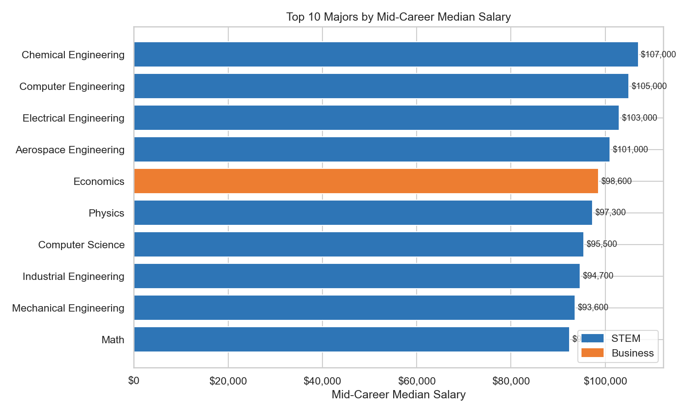
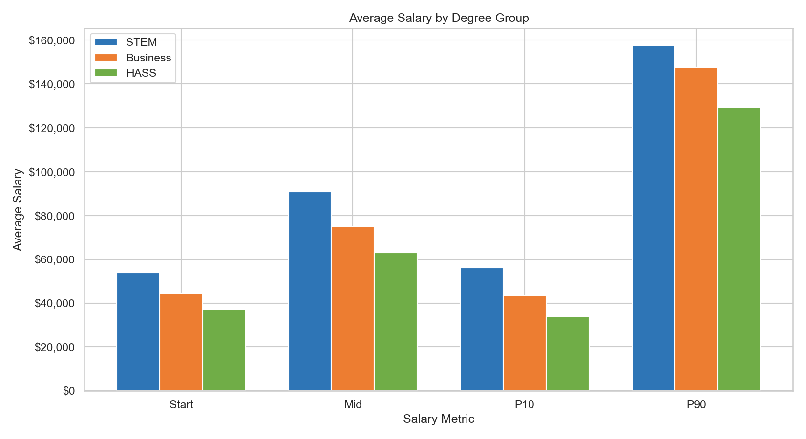
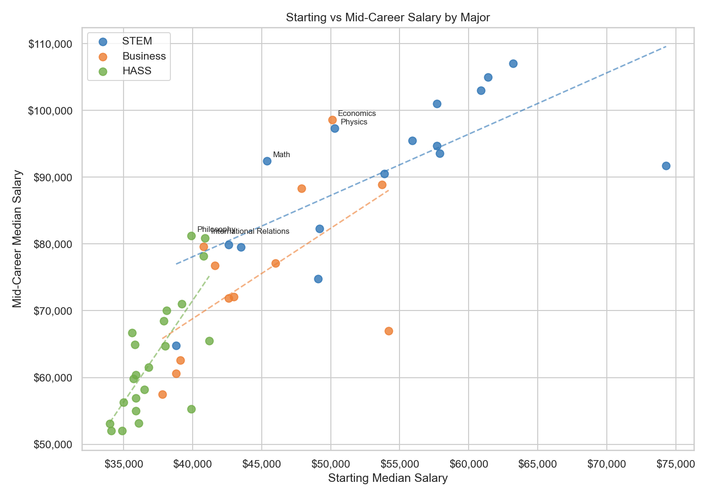
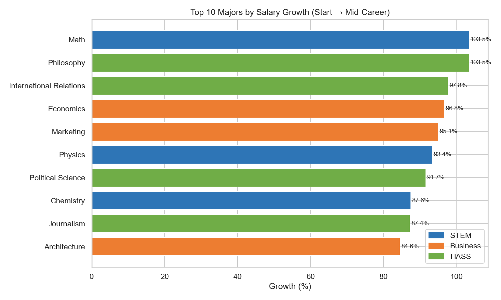
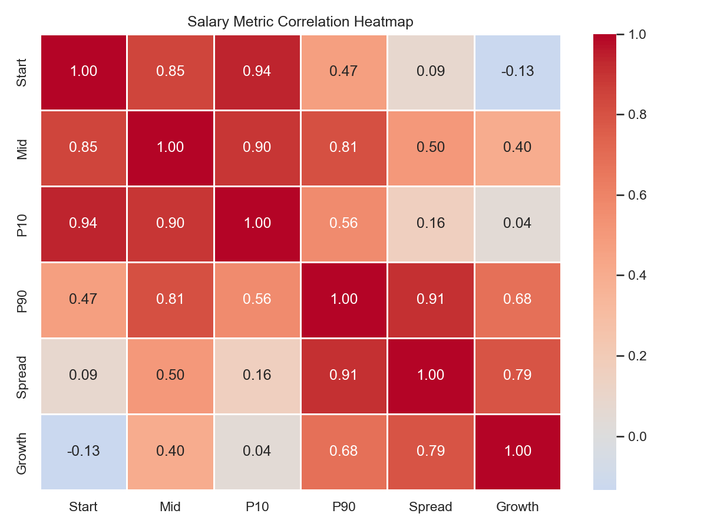
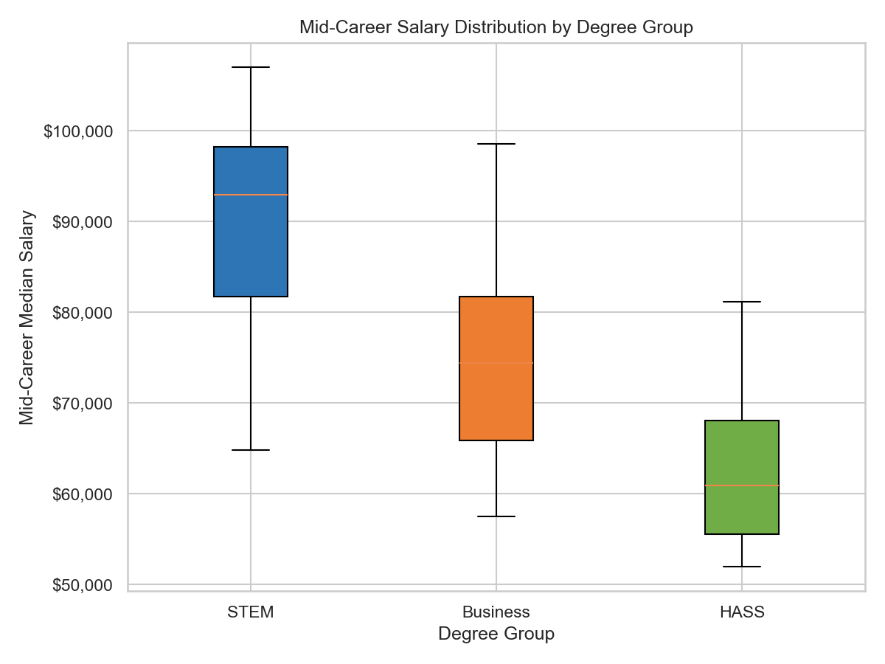
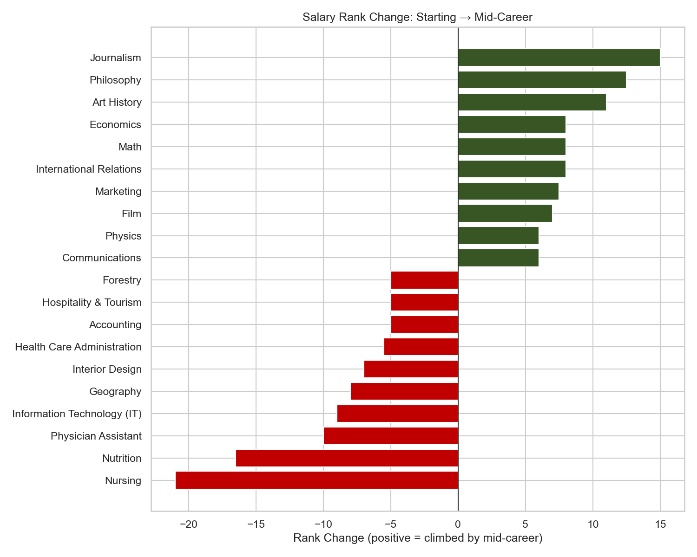

# College Salary Data Analysis

Exploratory data analysis of post-university salary outcomes across 51 undergraduate majors — sourced from a Wall Street Journal / PayScale survey of 1.2 million Americans with bachelor's degrees.

Demonstrates 60+ Pandas operations across inspection, cleaning, feature engineering, filtering, aggregation, groupby, sorting, reshaping, apply, string operations, correlation analysis, and visualisation.

**Notebook → [analysis.ipynb](analysis.ipynb)**
&nbsp;&nbsp;·&nbsp;&nbsp;
**Script → [analysis.py](analysis.py)**
&nbsp;&nbsp;·&nbsp;&nbsp;
**Course Notes → [docs/COURSE_NOTES.md](docs/COURSE_NOTES.md)**

---

## Table of Contents

0. [Prerequisites](#0-prerequisites)
1. [Quick Start](#1-quick-start)
2. [Project Structure](#2-project-structure)
3. [Dataset](#3-dataset)
4. [Analysis Sections](#4-analysis-sections)
5. [Key Findings](#5-key-findings)
6. [Visualisations](#6-visualisations)
7. [Operations Reference](#7-operations-reference)
8. [Course Context](#8-course-context)
9. [Dependencies](#9-dependencies)

---

## 0. Prerequisites

- Python 3.11+
- pip

---

## 1. Quick Start

```bash
git clone https://github.com/xavier-oc-programming/college-salary-data-analysis.git
cd college-salary-data-analysis
pip install -r requirements.txt
```

**Run the script** (generates all plots and exports to `data/`):

```bash
python analysis.py
```

**Open the notebook** (interactive, charts inline):

```bash
jupyter notebook analysis.ipynb
```

Select **Restart & Run All** to execute from top to bottom.

### Analysis Flow

```
pipeline
    │
    │  ── [Ingestion] ────────────────────────────────────────────────
    ├── pd.read_csv()  →  salaries_by_college_major.csv  →  df (52 rows × 6 columns)
    │
    │  ── [Inspection] ───────────────────────────────────────────────
    ├── .head() / .tail()        →  preview rows, spot the NaN footer row
    ├── .shape / .columns        →  confirm 52 rows × 6 columns and column names
    ├── .isna() / .isna().sum()  →  NaN confirmed to last row only
    │
    │  ── [Cleaning] ─────────────────────────────────────────────────
    ├── df.dropna()  →  clean_df  (NaN footer removed — 51 majors remain)
    │
    │  ── [Lookup] ───────────────────────────────────────────────────
    ├── .max() / .idxmax()      →  row index of highest starting salary major
    ├── .min() / .idxmin()      →  row index of lowest starting / mid-career salary major
    ├── clean_df.loc[idx, col]  →  major name retrieved at that index
    │
    │  ── [Feature Engineering] ──────────────────────────────────────
    ├── 90th Percentile − 10th Percentile        →  Spread (salary risk proxy)
    ├── (Mid − Start) / Start × 100              →  Growth %
    ├── Start / Spread                           →  Safety score
    ├── .rank(ascending=False)                   →  Start_Rank, Mid_Rank
    ├── Start_Rank − Mid_Rank                    →  Rank_Change
    ├── pd.cut(Start, bins=3)                    →  Salary_Band
    ├── groupby.transform('mean')                →  Group_Avg_Start
    │
    │  ── [Ranking] ──────────────────────────────────────────────────
    ├── .sort_values('Spread')                                        →  low risk majors
    ├── .sort_values('P90', ascending=False)                          →  highest ceiling majors
    ├── .sort_values('Growth', ascending=False)                       →  biggest growers
    ├── .sort_values('Rank_Change', ascending=False)                  →  biggest rank climbers
    │
    │  ── [Aggregation & GroupBy] ────────────────────────────────────
    ├── .groupby('Group').mean()   →  per-category salary averages
    ├── .pivot_table()             →  cross-tabulation by group
    ├── .corr()                    →  pairwise correlation matrix
    │
    │  ── [Export] ───────────────────────────────────────────────────
    ├── to_csv  →  data/clean_salaries.csv, data/group_summary.csv
    └── to_json →  data/salaries.json
```

---

## 2. Project Structure

```
college-salary-data-analysis/
│
├── analysis.py              # Standalone script — runs full pipeline, saves plots
├── analysis.ipynb           # Notebook — same pipeline with markdown explanations
│
├── data/
│   ├── salaries_by_college_major.csv   # Source dataset (WSJ/PayScale)
│   ├── clean_salaries.csv              # Generated by analysis.py
│   ├── group_summary.csv               # Generated by analysis.py
│   └── salaries.json                   # Generated by analysis.py
│
├── plots/                   # All 7 charts — generated by analysis.py
│   ├── 01_top10_midcareer.png
│   ├── 02_group_comparison.png
│   ├── 03_scatter_salary_trajectory.png
│   ├── 04_top10_growth.png
│   ├── 05_correlation_heatmap.png
│   ├── 06_boxplot_by_group.png
│   └── 07_rank_change.png
│
├── docs/
│   └── COURSE_NOTES.md      # Course notes + extended analysis reference
│
├── requirements.txt
└── README.md
```

---

## 3. Dataset

**File:** `data/salaries_by_college_major.csv`  
**Source:** Wall Street Journal / PayScale survey of 1.2 million Americans with bachelor's degrees  
**Rows:** 51 majors (52 in raw file — last row is a NaN footer, removed on clean)

**Degree categories**

| Code | Full name | Fields |
|---|---|---|
| STEM | Science, Technology, Engineering, Mathematics | Technical and quantitative disciplines |
| Business | Business & Commerce | Applied professional and commercial fields |
| HASS | Humanities, Arts, and Social Sciences | Interpretive, creative, and social fields |

**Source columns**

| Column | Type | Description |
|---|---|---|
| Undergraduate Major | str | Major name |
| Starting Median Salary | float | Median salary at career start |
| Mid-Career Median Salary | float | Median salary at mid-career |
| Mid-Career 10th Percentile Salary | float | Lower bound — 10% of graduates earn below this |
| Mid-Career 90th Percentile Salary | float | Upper bound — 10% of graduates earn above this |
| Group | str | Degree category: STEM / Business / HASS |

**Computed columns added at runtime**

| Column | Formula | Description |
|---|---|---|
| Spread | P90 − P10 | Salary range — proxy for earnings risk |
| Growth | (Mid − Start) / Start × 100 | Percentage salary increase by mid-career |
| Safety | Start / Spread | Predictability relative to variability |
| Rank_Change | Start_Rank − Mid_Rank | Movement in salary rank: positive = climbed |
| Salary_Band | pd.cut(Start, bins=3) | Low / Medium / High starting salary tier |
| Group_Avg_Start | groupby transform | Mean starting salary for the same degree group |
| vs_group_avg | Start − Group_Avg_Start | How far above/below the group average |

---

## 4. Analysis Sections

| # | Section | Key operations |
|---|---|---|
| 1 | Load | `pd.read_csv()` |
| 2 | Inspection & Profiling | `shape`, `info`, `describe`, `dtypes`, `nunique`, `value_counts`, `duplicated`, `memory_usage`, `isna`, `isna().sum`, `head`, `tail` |
| 3 | Cleaning | `dropna`, `reset_index`, `rename`, `fillna` (demo) |
| 4 | Feature Engineering | column arithmetic, `rank`, `pd.cut`, `==` boolean, `groupby.transform` |
| 5 | Selection & Filtering | `[]`, `[[]]`, `loc`, `iloc`, boolean mask, `&`, `isin`, `query`, `between`, `str.contains` |
| 6 | Aggregation | `sum`, `mean`, `median`, `std`, `var`, `min`, `max`, `idxmin`, `idxmax`, `quantile`, `agg`, `describe` |
| 7 | GroupBy | `groupby.mean`, `.median`, `.min`, `.max`, `.count`, `.agg`, `.nlargest`, `.apply`, `.transform` |
| 8 | Sorting & Ranking | `sort_values`, `nlargest`, `nsmallest`, `sort_index` |
| 9 | Reshaping & Pivoting | `pivot_table`, `set_index`, `.T`, `melt` |
| 10 | Apply & Map | `apply`, `map`, `str.upper`, `str.contains`, `str.len`, `str.split`, `pipe` |
| 11 | Display & Styling | `pd.options.display.float_format`, `max_rows`, `pd.reset_option` |
| 12 | Correlation Analysis | `corr`, upper-triangle masking, `stack`, HASS vs STEM comparison |
| 13 | Export | `to_csv`, `to_json` |
| 14 | Visualisations | 7 charts — bar, grouped bar, scatter+regression, heatmap, boxplot, rank-change |
| 15 | Key Findings | Live stats DataFrame + 8 business insights |

**Features covered:**

- Load and inspect the raw salary dataset (shape, columns, null counts)
- Detect and remove the trailing NaN row with `.isna()` / `.dropna()`
- Find highest and lowest starting and mid-career salary majors with `.idxmax()` / `.idxmin()`
- Engineer seven derived columns including Spread, Growth, Safety, and Rank_Change
- Filter by single and multiple conditions, membership, range, and substring
- Aggregate with twelve statistical functions across the full dataset
- Compare degree categories across four salary metrics using `.groupby()`
- Reshape data with pivot tables, melt, and transpose
- Apply row-wise logic and map categorical labels with dictionaries
- Compute pairwise Pearson correlation and identify the strongest pairs
- Export to CSV and JSON
- Generate seven publication-quality charts saved to `plots/`
- Format float output to comma-separated currency
- Display a live stats summary table using `pd.DataFrame` built from computed values
- Surface inline key findings as blockquote callouts at each point of discovery

---

## 5. Key Findings

Run `python analysis.py` or **Restart & Run All** in the notebook to populate exact figures.

1. **Chemical Engineering graduates earn the most at mid-career** — median of $107,000. One of only three majors to exceed $100k at mid-career median, alongside Computer Engineering and Electrical Engineering.

2. **Education is the lowest mid-career earner** — median of $52,000, roughly half the salary of the top STEM fields. The data makes the financial trade-off explicit.

3. **Math is the biggest salary grower** — 103.52% increase from start to mid-career. A field that starts modestly but more than doubles by mid-career, demonstrating that starting salary is a poor proxy for long-term earnings trajectory.

4. **Nursing offers the lowest earnings risk** — smallest Spread ($50,700) of the dataset. Regulated salary bands mean predictable outcomes regardless of employer or location.

5. **Economics has the highest earning ceiling** — P90 of $210,000, beating every engineering major. The top 10% of Economics graduates out-earn all other disciplines.

6. **STEM out-earns HASS by ~$28,000 at mid-career on average** — the gap is real but partly driven by low-paying HASS fields like Education and Religion pulling the average down. Within-group variance is high on both sides.

7. **Starting salary strongly predicts mid-career salary** — Pearson r = 0.848. Choosing a high-paying entry point is not just good in year one — it predicts the long-term trajectory.

8. **HASS and STEM have nearly identical salary growth rates** — average Growth is 68.86% (HASS) vs 70.40% (STEM), a gap of just 1.53 percentage points. The STEM advantage is in absolute starting salary, not in growth trajectory.

---

## 6. Visualisations

All charts are committed to `plots/` and visible without running the code.

### Top 10 Majors by Mid-Career Salary


### Average Salary by Degree Group


### Starting vs Mid-Career Salary Trajectory


### Top 10 Majors by Salary Growth


### Salary Metric Correlation Heatmap


### Mid-Career Salary Distribution by Group


### Salary Rank Change: Start → Mid-Career


---

## 7. Operations Reference

### Inspection & Profiling
`shape` · `info()` · `describe()` · `dtypes` · `nunique()` · `value_counts()` · `duplicated().sum()` · `memory_usage(deep=True)` · `isna()` · `isna().sum()` · `head()` · `tail()`

### Cleaning
`dropna()` · `reset_index(drop=True)` · `rename(columns={})` · `fillna()`

### Feature Engineering
column arithmetic (`+`, `-`, `/`, `*`) · `rank(ascending=False)` · `pd.cut(bins, labels)` · boolean mask as column (`==`) · `groupby().transform('mean')`

### Selection & Filtering
`df['col']` · `df[['c1','c2']]` · `loc[row, col]` · `iloc[r:r, c:c]` · boolean mask · `&` multi-condition · `isin([])` · `query('')` · `between(lo, hi)` · `str.contains()`

### Aggregation
`sum()` · `mean()` · `median()` · `std()` · `var()` · `min()` · `max()` · `idxmin()` · `idxmax()` · `quantile(q)` · `agg(['mean','median','std'])` · `describe()`

### GroupBy
`groupby().mean(numeric_only=True)` · `.median()` · `.min()` · `.max()` · `.count()` · `.agg({'col': ['fn']})` · `.nlargest(n)` · `.apply(lambda)` · `.transform('mean')`

### Sorting & Ranking
`sort_values(col)` · `sort_values([c1,c2], ascending=[T,F])` · `nlargest(n, col)` · `nsmallest(n, col)` · `sort_index()`

### Reshaping & Pivoting
`pivot_table(values, index, aggfunc)` · `set_index(col)` · `.T` (transpose) · `melt(id_vars, value_vars, var_name, value_name)`

### Apply & Map
`apply(func, axis=1)` · `map(dict)` · `str.upper()` · `str.contains()` · `str.len()` · `str.split().str[0]` · `pipe(func)`

### Display & Styling
`pd.options.display.float_format` · `pd.options.display.max_rows` · `pd.reset_option()`

### Live Summary Output
`pd.DataFrame([tuples], columns=[...])` — builds a live stats table from computed values; re-evaluates on every run so figures stay in sync with the data automatically

### Correlation
`corr()` · `np.triu` upper-triangle mask · `where().stack()` pair extraction

### Export
`to_csv(index=False)` · `to_json(orient='records', indent=2)`

### Visualisation
`barh` · `bar` (grouped) · `scatter` · `annotate` · `np.polyfit` / `np.polyval` (regression) · `sns.heatmap` · `boxplot(patch_artist=True)` · `axvline` · `FuncFormatter` (currency axis) · `Patch` (custom legend) · `tight_layout` · `savefig`

---

## 8. Course Context

**100 Days of Code: The Complete Python Pro Bootcamp** — Day 72.  
Topics introduced by the course: pandas DataFrames, data cleaning, column arithmetic, sorting, indexing with `.loc`, `.groupby()` aggregation.

The course provided the foundation. This analysis extends it significantly — adding feature engineering, multi-condition filtering, statistical aggregation, correlation analysis, seven visualisations, JSON export, and a full standalone script alongside the notebook.

See [docs/COURSE_NOTES.md](docs/COURSE_NOTES.md) for the original exercise brief, key course concepts, and a complete reference of operations developed beyond the course material.

---

## 9. Dependencies

| Package | Version | Purpose |
|---|---|---|
| `pandas` | ≥ 2.0 | DataFrame creation, cleaning, analysis, aggregation |
| `numpy` | ≥ 1.24 | Array operations, regression coefficients, correlation masking |
| `matplotlib` | ≥ 3.7 | Chart rendering and saving |
| `seaborn` | ≥ 0.12 | Theme and heatmap |
| `jupyter` | ≥ 1.0 | Notebook server for `analysis.ipynb` |

Install all at once:

```bash
pip install -r requirements.txt
```
